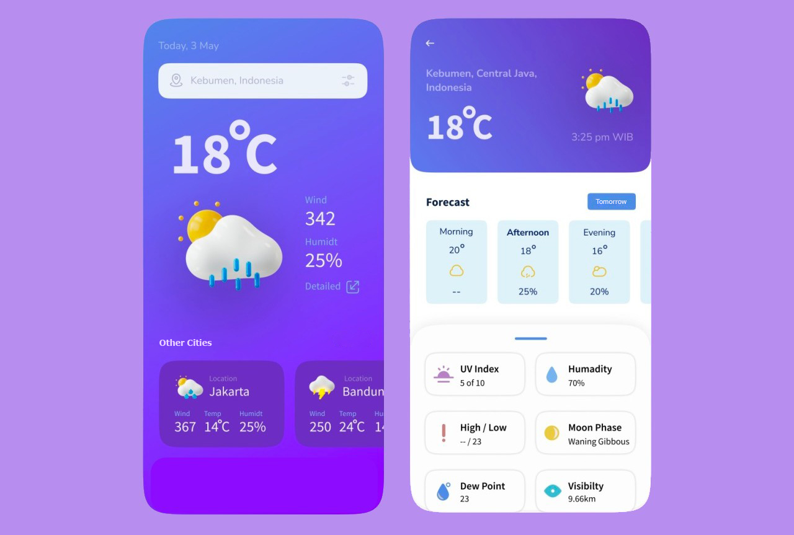

# React Native Challenge

Given the above screenshot, let's create a weather app! 💪

## Setup ⚙️
You should fork this repository and work on it. When you finish, please refer to [Delivery](#delivery-).

## Requirements 👩‍💻

### Main Screen
- On the app launch, it should prompt the user with his location to provide the main weather information.
- The user should be able to search for locations on the top bar, displaying the first ten results on a list. (See: https://www.weatherapi.com/docs/#apis-search).
- Tapping the **Detailed** button, should navigate to the details screen (the one on the right) and display the current location information.
- At the bottom of the main screen, five cities of your choice should be displayed in a carousel.
- Tapping on any card of the bottom carousel, should navigate to the details screen and display the information for that location.

### Details Screen
- Main information is displayed at the top.
- The arrow button should navigate back to the main screen.
- Forecast section should display cards containing temperature and humidity for different moments of the given day (see https://www.weatherapi.com/docs/#apis-realtime and https://www.weatherapi.com/docs/#apis-forecast). Being those moments:
	- 10hs (Morning)
	- 14hs (Afternoon)
	- 18hs (Evening)
	- 22hs (Night)
- Tapping on **Tomorrow** button should switch these cards information to display the following day's values. Also, you should be able to click again to change to Today's values.
- The bottom sheet should display other helpful information that the API delivers like UV index, wind speed, direction, and more.

## API Documentation 📄

- `Base URL`: http://api.weatherapi.com/v1
- `API KEY`: 6be8c28794924ed8a2a184922222905
- `Documentation`: https://www.weatherapi.com/docs/

## Delivery 🚀
Once your code is ready send the repository link via email to whoever sent it to you from Codea IT.